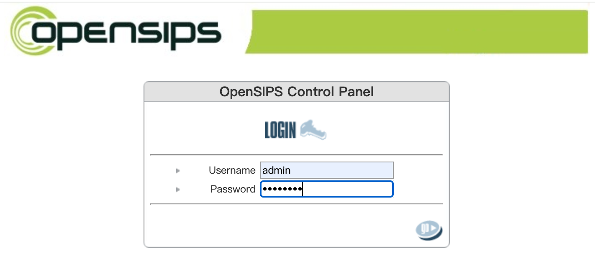
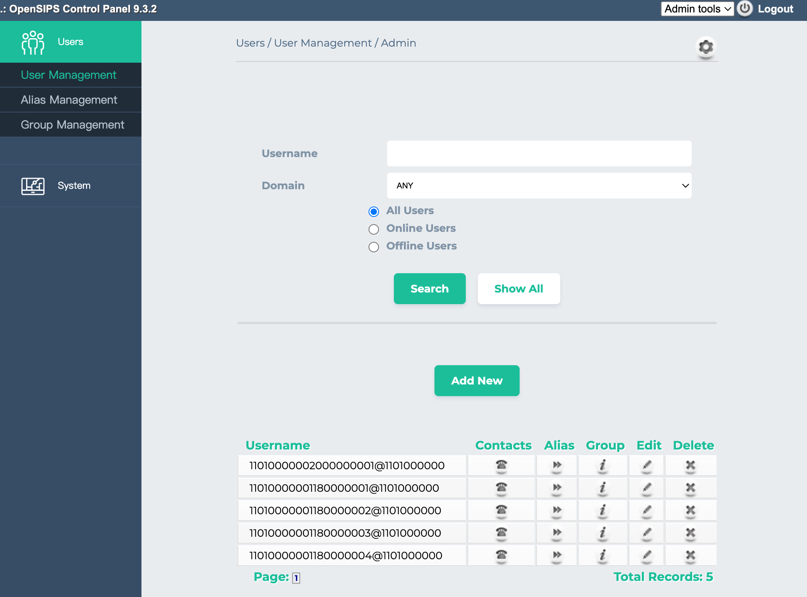

# OpenSIPs Control Panel Docker Image

This is a docker image for OpenSIPS Control Panel (OCP), see more details for OCP:

[http://controlpanel.opensips.org](http://controlpanel.opensips.org)

[GitHub - OpenSIPS/opensips-cp: A Web Control Panel Application for the OpenSIPS](https://github.com/OpenSIPS/opensips-cp)


This opensips-cp docker image is suit for **OpenSIPs v3.2**, and with MySQL as db backend.

## Environment Variables

* **DB_HOST**: db host ip
* **DB_PORT**: db port
* **DB_USER**: db user
* **DB_PASSWORD**: db password
* **DB_NAME**: opensips db name

## docker-compose example

```yaml
services:
  opensips-cp:
    image: eriklee1895/opensips-cp:9.3.2
    build: .
    container_name: opensips-cp
    ports:
      - 5180:80
    environment:
      DB_HOST: 192.168.1.100
      DB_PORT: 3306
      DB_USER: root
      DB_PASSWORD: root
      DB_NAME: opensips
```

run: `docker compose up -d`

stop: `docker compose down`

## Login

```
http://127.0.0.1:5180
```



the default account is`admin`/`opensips`



